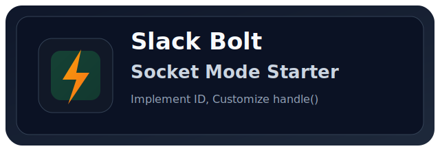

<p align="center">
  
</p>

<h1 align="center">Slack Bolt Socket Mode Spring Boot Starter</h1>

<p align="center">
  Slack Socket Mode 핸들러를 <strong>빠르게</strong>, <strong>안정적으로</strong>, <strong>일관되게</strong> 붙이기 위한 Spring Boot Starter
</p>

<p align="center">
  <a href="https://openjdk.org/"></a>
  <a href="https://spring.io/projects/spring-boot"></a>
  <a href="https://central.sonatype.com/artifact/io.github.inshakr2/slack-bolt-socket-mode-spring-boot-starter"></a>
  <a href="https://central.sonatype.com/artifact/io.github.inshakr2/slack-bolt-socket-mode-core"></a>
  <a href="https://github.com/inshakr2/slack-bolt-socket-mode-spring-boot-starter/actions/workflows/build-test.yml"></a>
  <a href="./LICENSE"></a>
</p>

<p align="center">
  한국어 · <a href="./docs/readme/README.en.md">English</a>
</p>

---

Slack Bolt App 웹소켓 연동마다 등록 코드, 예외 처리, 수명주기 관리를 반복해서 작성하지 마세요.  
Slack Bolt Socket Mode Spring Boot Starter는 이 반복 작업을 공통화해서 더 안정적이고 더 편리하게 연동하도록 돕습니다.  
표준 핸들러 타입뿐 아니라, 팀에서 필요한 커스텀 패턴도 같은 방식으로 확장할 수 있습니다.

```java
@Component
public class TicketSubmitHandler extends AbstractViewSubmissionHandler {

    @Override
    protected String getCallbackId() {
        return "ticket-submit-callback";
    }

    @Override
    protected Response handle(ViewSubmissionRequest req, ViewSubmissionContext ctx) {
        return ctx.ack();
    }
}
```

---

### 무엇이 좋아지나?
- Slack Bolt 핸들러 등록을 자동화해서 비즈니스 로직 구현에 집중할 수 있습니다.
- 핸들러 예외 발생 시 공통 로깅 + `ctx.ack()` fallback으로 응답 안정성을 높입니다.
- 핸들러 식별자(identifier) 중복을 앱 시작 시 Fail-Fast로 차단합니다.
- `action_id` / `callback_id` / `command`만 정확히 정의하면 바로 동작합니다.

### 왜 편한가? (직접 구현 대비)

| 항목 | 직접 구현 시 | Starter 사용 시 |
|---|---|---|
| 핸들러 등록 | `App` 등록 코드/분기 직접 작성 | 추상 핸들러 구현 + `@Component` |
| 예외 처리 | 핸들러마다 try/catch 반복 | 공통 보호 래퍼 내장 |
| 중복 식별자 검증 | 별도 Set 검증 코드 필요 | 자동 검증 내장 |
| Socket Mode 시작/종료 | 수명주기 직접 관리 | 자동 구성/자동 시작 옵션 |
| 구현 집중 포인트 | 인프라 코드 + 비즈니스 코드 혼재 | `handle()` 비즈니스 로직 중심 |

## 3분 사용법

### 1) 의존성 추가

#### Gradle
```gradle
dependencies {
    implementation "io.github.inshakr2:slack-bolt-socket-mode-spring-boot-starter:1.0.0"
}
```

#### Maven
```xml
<dependencies>
  <dependency>
    <groupId>io.github.inshakr2</groupId>
    <artifactId>slack-bolt-socket-mode-spring-boot-starter</artifactId>
    <version>1.0.0</version>
  </dependency>
</dependencies>
```

### 2) Slack App 생성 (Manifest)

1. Slack App 생성 화면에서 **From an app manifest** 선택
2. [`slack-bolt-socket-mode-sample/manifest.json`](./slack-bolt-socket-mode-sample/manifest.json) 내용 붙여넣기
3. 토큰 발급 전 아래 설정을 먼저 완료
   - **Socket Mode 활성화** 및 App-Level Token(`xapp-...`) 생성 (`connections:write` scope 필요)
   - **OAuth scopes** 설정 후 워크스페이스에 앱 설치 (Bot Token `xoxb-...` 발급)
4. 발급한 토큰을 환경 변수로 설정

```bash
export SLACK_BOT_TOKEN=xoxb-...
export SLACK_APP_TOKEN=xapp-...
```

자세한 가이드는 Slack 공식 문서를 참고하세요.
- [Configuring apps with app manifests](https://docs.slack.dev/app-manifests/configuring-apps-with-app-manifests/)
- [Socket Mode](https://docs.slack.dev/apis/socket-mode)
- [Tokens](https://docs.slack.dev/authentication/tokens/)

### 3) 애플리케이션 설정

```yaml
slack:
  bolt:
    socket-mode:
      enabled: true
      bot-token: ${SLACK_BOT_TOKEN}
      app-token: ${SLACK_APP_TOKEN}
      socket-mode-enabled: true
      socket-mode-auto-startup: true
```

### 4) 핸들러 작성 (핵심)

`callback_id`(또는 `action_id`, `command`)를 지정하고, `handle()`에 원하는 로직만 작성하면 됩니다.

```java
// src/main/java/.../handler/VocConfirmSubmitHandler.java
@Component
public class VocConfirmSubmitHandler extends AbstractViewSubmissionHandler {

    @Override
    protected String getCallbackId() {
        return "voc-confirm-submit-callback";
    }

    @Override
    protected Response handle(ViewSubmissionRequest req, ViewSubmissionContext ctx) {
        // 비즈니스 로직 커스터마이징
        return ctx.ack();
    }
}
```

```java
// src/main/java/.../handler/PingActionHandler.java
@Component
public class PingActionHandler extends AbstractBlockActionHandler {

    @Override
    protected String getActionId() {
        return "socket-mode-ping-action";
    }

    @Override
    protected Response handle(BlockActionRequest req, ActionContext ctx) {
        // 비즈니스 로직 커스터마이징
        return ctx.ack();
    }
}
```

### 5) 실행

```bash
./gradlew :slack-bolt-socket-mode-sample:bootRun
```

## 직접 구현 예시 vs Starter 예시

편의성 차이는 코드 양보다 유지보수 범위에서 더 크게 벌어집니다.

| 비교 포인트 | 직접 구현 | Starter 사용 |
|---|---|---|
| 신규 인터랙션 1개 추가 | 설정 클래스 + 등록 코드 + 예외 처리 코드까지 함께 수정 | 핸들러 클래스 1개 추가 후 `id + handle()`만 구현 |
| 공통 정책 변경(로깅/응답) | 모든 핸들러 등록부 점검/수정 필요 | 공통 계층에서 일괄 반영 |
| 운영 안정성 | 중복 식별자/예외 누락을 코드 리뷰로만 방지 | Fail-Fast + fallback 기본 제공 |

### 직접 구현 시 필요한 클래스 예시

직접 구현할 때는 보통 아래 클래스들을 직접 작성해야 합니다.

- `src/main/java/.../config/SlackManualBoltConfig.java` (Bolt `App` 생성 + 핸들러 등록)
- `src/main/java/.../lifecycle/SocketModeRunner.java` (Socket Mode 시작/종료)
- `src/main/java/.../registry/HandlerIdentifierValidator.java` (식별자 중복 검증)

```java
// src/main/java/.../config/SlackManualBoltConfig.java
@Configuration
public class SlackManualBoltConfig {

    @Bean
    public App slackApp(@Value("${slack.bolt.bot-token}") String botToken) {
        App app = new App(AppConfig.builder()
                .singleTeamBotToken(botToken)
                .build());

        app.command("/socket-mode-hello", (req, ctx) -> {
            try {
                return ctx.ack("hello");
            } catch (Exception e) {
                log.error("command failed", e);
                return ctx.ack();
            }
        });

        app.blockAction("socket-mode-ping-action", (req, ctx) -> {
            try {
                return ctx.ack();
            } catch (Exception e) {
                log.error("block action failed", e);
                return ctx.ack();
            }
        });

        app.viewSubmission("voc-confirm-submit-callback", (req, ctx) -> {
            try {
                return ctx.ack();
            } catch (Exception e) {
                log.error("view submission failed", e);
                return ctx.ack();
            }
        });

        return app;
    }
}
```

```java
// src/main/java/.../lifecycle/SocketModeRunner.java
@Component
public class SocketModeRunner {

    private final App app;
    private final String appToken;
    private SocketModeApp socketModeApp;

    public SocketModeRunner(App app, @Value("${slack.bolt.app-token}") String appToken) {
        this.app = app;
        this.appToken = appToken;
    }

    @PostConstruct
    public void start() throws Exception {
        socketModeApp = new SocketModeApp(appToken, app);
        socketModeApp.startAsync();
    }

    @PreDestroy
    public void stop() throws Exception {
        if (socketModeApp != null) {
            socketModeApp.close();
        }
    }
}
```

```java
// src/main/java/.../registry/HandlerIdentifierValidator.java
@Component
public class HandlerIdentifierValidator {

    public void validate(List<String> identifiers) {
        Set<String> unique = new HashSet<>();
        for (String id : identifiers) {
            if (!unique.add(id)) {
                throw new IllegalStateException("Duplicate Slack handler identifier: " + id);
            }
        }
    }
}
```

### Starter 사용 시 클래스 예시

Starter를 사용하면 대부분의 인프라 코드는 자동 구성에 맡기고, 핸들러 클래스만 작성하면 됩니다.

```java
// src/main/java/.../handler/HelloCommandHandler.java
@Component
public class HelloCommandHandler extends AbstractCommandHandler {

    @Override
    protected String getCommand() {
        return "/socket-mode-hello";
    }

    @Override
    protected Response handle(SlashCommandRequest req, SlashCommandContext ctx) {
        return ctx.ack("hello");
    }
}
```

핵심 차이: 직접 구현은 인프라 코드를 계속 유지해야 하지만, Starter는 기능 추가 시에도 `식별자 + handle()`만 확장하면 됩니다.

## 설정 레퍼런스

| Key | Required | Default | Description |
|---|---|---|---|
| `slack.bolt.socket-mode.enabled` | N | `true` | starter 활성화 여부 |
| `slack.bolt.socket-mode.bot-token` | Y (`enabled=true`) | - | Slack bot token |
| `slack.bolt.socket-mode.socket-mode-enabled` | N | `true` | Socket Mode 사용 여부 |
| `slack.bolt.socket-mode.app-token` | Y (`socket-mode-enabled=true`) | - | Slack app token |
| `slack.bolt.socket-mode.socket-mode-auto-startup` | N | `true` | 앱 시작 시 Socket Mode 자동 시작 여부 |

> `1.0.0`부터 starter가 Socket Mode 필수 런타임(`javax.websocket-api`, `tyrus-standalone-client`)을 기본 제공합니다.

## 지원 핸들러 타입

- `AbstractCommandHandler`
- `AbstractBlockActionHandler`
- `AbstractViewSubmissionHandler`
- `AbstractGlobalShortcutHandler`
- `AbstractMessageEventHandler`
- `AbstractAppHomeOpenedEventHandler`

## Experimental: Modal Input DSL (Phase 1)

반복적으로 작성하던 `block_id`, `action_id`, `input(...)` 블록 생성을 공통 DSL로 줄일 수 있습니다.

```java
import io.github.inshakr2.slackboltsocketmode.core.experimental.modal.ModalFieldKey;
import io.github.inshakr2.slackboltsocketmode.core.experimental.modal.ModalOption;
import io.github.inshakr2.slackboltsocketmode.core.experimental.modal.SlackModalBuilder;

ModalFieldKey<String> ownerKey = ModalFieldKey.singleSelect("owner");
ModalFieldKey<?> targetDateKey = ModalFieldKey.date("target_date");
ModalFieldKey<?> targetTimeKey = ModalFieldKey.time("target_time");
ModalFieldKey<String> agendaKey = ModalFieldKey.text("agenda");

View view = SlackModalBuilder.modal("socket-mode-view-submit", "Sample Modal", "Submit", "Cancel")
        .privateMetadata("source=global_shortcut")
        .addHeader("Schedule a follow-up action")
        .addStaticSelect(ownerKey, "Owner", "Select owner", List.of(
                ModalOption.of("Operator A", "1001"),
                ModalOption.of("Operator B", "1002")
        ), false)
        .addDatePicker(targetDateKey, "Target date", "Pick a date", false)
        .addTimePicker(targetTimeKey, "Target time", "Pick a time", false)
        .addTextInput(agendaKey, "Agenda", "Describe the agenda", false, true)
        .build();
```

- `ModalFieldKey`가 `block_id/action_id`를 자동 생성합니다.
- `SlackModalBuilder`는 callback/title/submit/close와 input block을 한 번에 조립합니다.
- 현재 지원 입력 타입: `plain_text_input`, `datepicker`, `timepicker`, `static_select`, `radio_buttons`

## 안전 장치

- 핸들러 실행 예외 시 공통 로깅 후 `ctx.ack()` fallback
- 핸들러 식별자 중복 시 앱 시작 단계에서 즉시 실패(Fail-Fast)

## 로컬 검증

```bash
./gradlew clean test
./gradlew publishToMavenLocal -Psigning.skip=true
```

## 모듈

- `slack-bolt-socket-mode-core`
- `slack-bolt-socket-mode-spring-boot-starter`
- `slack-bolt-socket-mode-sample` (예제 앱, 배포 대상 아님)

## 보안 주의

- 실제 Slack 토큰은 저장소에 커밋하지 마세요.
- CI 비밀값(`secrets`) 또는 런타임 환경변수만 사용하세요.

## 라이선스

[Apache License 2.0](./LICENSE)
