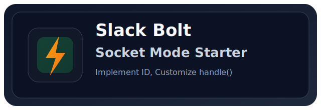

<p align="center">
  
</p>

<h1 align="center">Slack Bolt Socket Mode Spring Boot Starter</h1>

<p align="center">
  A Spring Boot starter to wire Slack Socket Mode handlers <strong>fast</strong>, <strong>reliably</strong>, and <strong>consistently</strong>
</p>

<p align="center">
  <a href="https://openjdk.org/"></a>
  <a href="https://spring.io/projects/spring-boot"></a>
  <a href="https://central.sonatype.com/artifact/io.github.inshakr2/slack-bolt-socket-mode-spring-boot-starter"></a>
  <a href="https://central.sonatype.com/artifact/io.github.inshakr2/slack-bolt-socket-mode-core"></a>
  <a href="https://github.com/inshakr2/slack-bolt-socket-mode-spring-boot-starter/actions/workflows/build-test.yml"></a>
  <a href="../../LICENSE"></a>
</p>

<p align="center">
  <a href="../../README.md">한국어</a> · English
</p>

---

Stop writing manual Socket Mode wiring for every Slack Bolt app.  
Slack Bolt Socket Mode Spring Boot Starter standardizes registration, fallback handling, and lifecycle control so integration stays stable and simple.  
Even when you need custom interaction patterns, you can extend them with the same handler approach.

```java
@Component
public class TicketSubmitHandler extends AbstractViewSubmissionHandler {

    @Override
    protected String getCallbackId() {
        return "ticket-submit-callback";
    }

    @Override
    protected Response handle(ViewSubmissionRequest req, ViewSubmissionContext ctx) {
        return ctx.ack();
    }
}
```

---

### Why this starter?
- Automates Slack Bolt handler registration so you can focus on business logic.
- Improves response stability with common logging + `ctx.ack()` fallback on exceptions.
- Blocks duplicate handler identifiers at startup with fail-fast validation.
- Works as soon as `action_id` / `callback_id` / `command` is defined correctly.

### Without this starter vs with this starter

| Item | Without starter | With starter |
|---|---|---|
| Handler registration | Manual `App` registration and branching | Implement abstract handler + `@Component` |
| Error handling | Repeated try/catch per handler | Built-in protected wrapper |
| Duplicate identifier checks | Separate Set validation code | Built-in automatic validation |
| Socket Mode lifecycle | Manual startup/shutdown management | Auto configuration + auto startup option |
| Main coding focus | Infra code mixed with business logic | Focus on business logic in `handle()` |

## Quick usage

### 1) Add dependencies

#### Gradle
```gradle
dependencies {
    implementation "io.github.inshakr2:slack-bolt-socket-mode-spring-boot-starter:1.0.0"
}
```

#### Maven
```xml
<dependencies>
  <dependency>
    <groupId>io.github.inshakr2</groupId>
    <artifactId>slack-bolt-socket-mode-spring-boot-starter</artifactId>
    <version>1.0.0</version>
  </dependency>
</dependencies>
```

### 2) Create Slack App (Manifest)

1. In Slack App creation, choose **From an app manifest**
2. Paste [`slack-bolt-socket-mode-sample/manifest.json`](../../slack-bolt-socket-mode-sample/manifest.json)
3. Complete token-related setup first
   - Enable **Socket Mode** and create an App-Level Token (`xapp-...`) with `connections:write`
   - Configure **OAuth scopes** and install the app to the workspace to issue Bot Token (`xoxb-...`)
4. Export issued tokens as environment variables

```bash
export SLACK_BOT_TOKEN=xoxb-...
export SLACK_APP_TOKEN=xapp-...
```

For detailed steps, refer to Slack official documentation.
- [Configuring apps with app manifests](https://docs.slack.dev/app-manifests/configuring-apps-with-app-manifests/)
- [Socket Mode](https://docs.slack.dev/apis/socket-mode)
- [Tokens](https://docs.slack.dev/authentication/tokens/)

### 3) Configure application properties

```yaml
slack:
  bolt:
    socket-mode:
      enabled: true
      bot-token: ${SLACK_BOT_TOKEN}
      app-token: ${SLACK_APP_TOKEN}
      socket-mode-enabled: true
      socket-mode-auto-startup: true
```

### 4) Write handler classes (core)

Set `callback_id` (or `action_id`, `command`) and only implement custom logic inside `handle()`.

```java
// src/main/java/.../handler/VocConfirmSubmitHandler.java
@Component
public class VocConfirmSubmitHandler extends AbstractViewSubmissionHandler {

    @Override
    protected String getCallbackId() {
        return "voc-confirm-submit-callback";
    }

    @Override
    protected Response handle(ViewSubmissionRequest req, ViewSubmissionContext ctx) {
        // Custom business logic
        return ctx.ack();
    }
}
```

```java
// src/main/java/.../handler/PingActionHandler.java
@Component
public class PingActionHandler extends AbstractBlockActionHandler {

    @Override
    protected String getActionId() {
        return "socket-mode-ping-action";
    }

    @Override
    protected Response handle(BlockActionRequest req, ActionContext ctx) {
        // Custom business logic
        return ctx.ack();
    }
}
```

### 5) Run

```bash
./gradlew :slack-bolt-socket-mode-sample:bootRun
```

## Direct implementation example vs Starter example

The convenience gap grows more in maintenance scope than in just line count.

| Comparison point | Without starter | With starter |
|---|---|---|
| Add one new interaction | Update config class, registration logic, and error handling paths | Add one handler class and implement `id + handle()` |
| Change common policy (logging/ack rules) | Revisit and edit multiple registration branches | Apply once in shared layer |
| Operational stability | Prevent duplicate IDs/exception leaks mainly by review | Built-in fail-fast + fallback |

### Example classes required in manual implementation

In manual implementation, you typically need to write classes like below.

- `src/main/java/.../config/SlackManualBoltConfig.java` (build Bolt `App` + register handlers)
- `src/main/java/.../lifecycle/SocketModeRunner.java` (start/stop Socket Mode)
- `src/main/java/.../registry/HandlerIdentifierValidator.java` (validate duplicate identifiers)

```java
// src/main/java/.../config/SlackManualBoltConfig.java
@Configuration
public class SlackManualBoltConfig {

    @Bean
    public App slackApp(@Value("${slack.bolt.bot-token}") String botToken) {
        App app = new App(AppConfig.builder()
                .singleTeamBotToken(botToken)
                .build());

        app.command("/socket-mode-hello", (req, ctx) -> {
            try {
                return ctx.ack("hello");
            } catch (Exception e) {
                log.error("command failed", e);
                return ctx.ack();
            }
        });

        app.blockAction("socket-mode-ping-action", (req, ctx) -> {
            try {
                return ctx.ack();
            } catch (Exception e) {
                log.error("block action failed", e);
                return ctx.ack();
            }
        });

        app.viewSubmission("voc-confirm-submit-callback", (req, ctx) -> {
            try {
                return ctx.ack();
            } catch (Exception e) {
                log.error("view submission failed", e);
                return ctx.ack();
            }
        });

        return app;
    }
}
```

```java
// src/main/java/.../lifecycle/SocketModeRunner.java
@Component
public class SocketModeRunner {

    private final App app;
    private final String appToken;
    private SocketModeApp socketModeApp;

    public SocketModeRunner(App app, @Value("${slack.bolt.app-token}") String appToken) {
        this.app = app;
        this.appToken = appToken;
    }

    @PostConstruct
    public void start() throws Exception {
        socketModeApp = new SocketModeApp(appToken, app);
        socketModeApp.startAsync();
    }

    @PreDestroy
    public void stop() throws Exception {
        if (socketModeApp != null) {
            socketModeApp.close();
        }
    }
}
```

```java
// src/main/java/.../registry/HandlerIdentifierValidator.java
@Component
public class HandlerIdentifierValidator {

    public void validate(List<String> identifiers) {
        Set<String> unique = new HashSet<>();
        for (String id : identifiers) {
            if (!unique.add(id)) {
                throw new IllegalStateException("Duplicate Slack handler identifier: " + id);
            }
        }
    }
}
```

### Example class with starter

With starter, most infra is auto-configured and you mainly write handler classes.

```java
// src/main/java/.../handler/HelloCommandHandler.java
@Component
public class HelloCommandHandler extends AbstractCommandHandler {

    @Override
    protected String getCommand() {
        return "/socket-mode-hello";
    }

    @Override
    protected Response handle(SlashCommandRequest req, SlashCommandContext ctx) {
        return ctx.ack("hello");
    }
}
```

Key difference: manual implementation keeps accumulating infra maintenance, while starter lets new features stay focused on `identifier + handle()`.

## Property reference

| Key | Required | Default | Description |
|---|---|---|---|
| `slack.bolt.socket-mode.enabled` | N | `true` | Enable starter |
| `slack.bolt.socket-mode.bot-token` | Y (`enabled=true`) | - | Slack bot token |
| `slack.bolt.socket-mode.socket-mode-enabled` | N | `true` | Enable Socket Mode |
| `slack.bolt.socket-mode.app-token` | Y (`socket-mode-enabled=true`) | - | Slack app token |
| `slack.bolt.socket-mode.socket-mode-auto-startup` | N | `true` | Auto start Socket Mode on app startup |

> Since `1.0.0`, the starter includes required Socket Mode runtimes (`javax.websocket-api`, `tyrus-standalone-client`) by default.

## Supported handler types

- `AbstractCommandHandler`
- `AbstractBlockActionHandler`
- `AbstractViewSubmissionHandler`
- `AbstractGlobalShortcutHandler`
- `AbstractMessageEventHandler`
- `AbstractAppHomeOpenedEventHandler`

## Safety features

- Common logging + `ctx.ack()` fallback on handler exceptions
- Fail-fast startup error when handler identifiers are duplicated

## Local verification

```bash
./gradlew clean test
./gradlew publishToMavenLocal -Psigning.skip=true
```

## Modules

- `slack-bolt-socket-mode-core`
- `slack-bolt-socket-mode-spring-boot-starter`
- `slack-bolt-socket-mode-sample` (sample app, not published)

## Security notes

- Do not commit real Slack tokens to the repository.
- Use CI secrets or runtime environment variables only.

## License

[Apache License 2.0](../../LICENSE)
